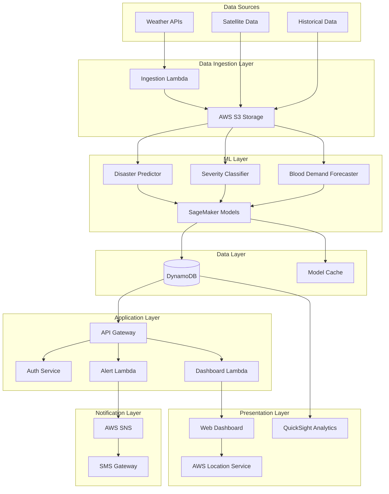

# Design Document: LifeGuard AI

## Overview

LifeGuard AI is a serverless, cloud-native disaster management and healthcare coordination system built on AWS infrastructure. The system uses machine learning models to predict disasters, classify severity, and forecast healthcare demands, then coordinates emergency response through multilingual SMS alerts and a real-time web dashboard.

The architecture follows a microservices pattern using AWS Lambda for compute, with data flowing through a pipeline from ingestion (S3) → processing (Lambda) → ML prediction (SageMaker) → storage (DynamoDB) → visualization (Dashboard) and alerting (SNS). The system is designed for high availability, automatic scaling, and low-bandwidth operation to serve both urban and rural populations across India.

## Architecture

### High-Level Architecture



### Component Architecture

The system consists of the following major components:

1. **Data Ingestion Pipeline**: Collects weather, satellite, and historical data from external sources and stores in S3
2. **ML Prediction Engine**: Three SageMaker models for disaster prediction, severity classification, and blood demand forecasting
3. **Alert Service**: Lambda-based service that sends multilingual SMS alerts via AWS SNS
4. **Dashboard Service**: Web application providing real-time visualization with AWS Location Service for mapping
5. **Data Storage**: DynamoDB for operational data, S3 for raw data and model artifacts
6. **Authentication & Authorization**: Role-based access control using AWS Cognito
7. **Analytics**: AWS QuickSight for advanced analytics and reporting

## Components and Interfaces

### 1. Data Ingestion Service

**Responsibility**: Fetch data from external sources, validate, and store in S3

**Interface**:
```python
class DataIngestionService:
    def ingest_weather_data(source_api: str, region: str) -> IngestionResult
    def ingest_satellite_data(s3_bucket: str, prefix: str) -> IngestionResult
    def validate_data(data: RawData) -> ValidationResult
    def store_data(data: RawData, metadata: DataMetadata) -> StorageResult
```

**Key Operations**:
- Scheduled ingestion every 6 hours via EventBridge
- Data validation against schemas
- Metadata tagging for data lineage
- Lifecycle policies for data retention

### 2. Disaster Predictor

**Responsibility**: Analyze weather, satellite, and historical data to predict disasters

**Interface**:
```python
class DisasterPredictor:
    def predict(weather_data: WeatherData, 
                satellite_data: SatelliteData, 
                historical_data: HistoricalData) -> DisasterPrediction
    
    def get_confidence_score(prediction: DisasterPrediction) -> float
    
    def get_affected_area(prediction: DisasterPrediction) -> GeographicalArea

class DisasterPrediction:
    disaster_type: str  # flood, cyclone, earthquake, etc.
    confidence: float  # 0.0 to 1.0
    coordinates: Tuple[float, float]  # latitude, longitude
    radius_km: float
    predicted_onset: datetime
    timestamp: datetime
```

**ML Model Details**:
- Model Type: Ensemble (Random Forest + Gradient Boosting + LSTM for time series)
- Input Features: 50+ features including rainfall, temperature, humidity, wind speed, historical patterns
- Training: AWS SageMaker with automatic model tuning
- Inference: Real-time via SageMaker endpoint

### 3. Severity Classifier

**Responsibility**: Classify predicted disasters into severity levels

**Interface**:
```python
class SeverityClassifier:
    def classify(prediction: DisasterPrediction, 
                 population_data: PopulationData,
                 infrastructure_data: InfrastructureData) -> SeverityClassification
    
    def explain_classification(classification: SeverityClassification) -> Explanation

class SeverityClassification:
    level: SeverityLevel  # MINIMAL, LOW, MODERATE, HIGH, CRITICAL
    confidence: float
    factors: List[ContributingFactor]
    explanation: str
    timestamp: datetime

class SeverityLevel(Enum):
    MINIMAL = 1
    LOW = 2
    MODERATE = 3
    HIGH = 4
    CRITICAL = 5
```

**Classification Logic**:
- Impact area × population density
- Historical damage patterns in region
- Infrastructure vulnerability score
- Confidence threshold: 0.7 for automatic classification

### 4. Blood Demand Forecaster

**Responsibility**: Forecast blood demand based on disaster predictions

**Interface**:
```python
class BloodDemandForecaster:
    def forecast(severity: SeverityClassification,
                 affected_population: int,
                 hospital_capacity: HospitalCapacity) -> BloodDemandForecast
    
    def get_donor_requirements(forecast: BloodDemandForecast,
                               current_supply: BloodSupply) -> DonorRequirements

class BloodDemandForecast:
    blood_type_demands: Dict[BloodType, int]  # units needed by blood type
    forecast_days: int  # 7 days
    daily_demand: List[DailyDemand]
    confidence: float
    timestamp: datetime

class BloodType(Enum):
    A_POSITIVE = "A+"
    A_NEGATIVE = "A-"
    B_POSITIVE = "B+"
    B_NEGATIVE = "B-"
    O_POSITIVE = "O+"
    O_NEGATIVE = "O-"
    AB_POSITIVE = "AB+"
    AB_NEGATIVE = "AB-"
```

**Forecasting Model**:
- Model Type: Time series forecasting (Prophet + LSTM)
- Input Features: Severity level, affected population, historical blood usage, hospital capacity
- Output: 7-day forecast by blood type

### 5. Alert Service

**Responsibility**: Send multilingual SMS alerts to affected users

**Interface**:
```python
class AlertService:
    def send_disaster_alert(prediction: DisasterPrediction,
                           severity: SeverityClassification,
                           affected_users: List[User]) -> AlertResult
    
    def send_donor_notification(donor: Donor,
                               blood_type: BloodType,
                               collection_center: CollectionCenter) -> AlertResult
    
    def translate_message(message: str, language: Language) -> str
    
    def retry_failed_alerts(failed_alerts: List[Alert]) -> AlertResult

class Alert:
    user_id: str
    phone_number: str
    message: str
    language: Language
    alert_type: AlertType  # DISASTER, DONOR_REQUEST
    status: AlertStatus  # PENDING, SENT, FAILED
    retry_count: int
    timestamp: datetime

class Language(Enum):
    HINDI = "hi"
    BENGALI = "bn"
    TELUGU = "te"
    MARATHI = "mr"
    TAMIL = "ta"
    GUJARATI = "gu"
    KANNADA = "kn"
    MALAYALAM = "ml"
    ODIA = "or"
    PUNJABI = "pa"
```

**Alert Workflow**:
1. Trigger: High/Critical severity prediction OR blood shortage detected
2. User Selection: Query DynamoDB for users in affected Risk_Zones
3. Message Generation: Create message with disaster details and recommended actions
4. Translation: Translate to user's preferred language
5. Delivery: Send via AWS SNS with retry logic (3 attempts, exponential backoff)
6. Tracking: Store delivery status in DynamoDB

### 6. Dashboard Service

**Responsibility**: Provide web interface for visualization and monitoring

**Interface**:
```python
class DashboardService:
    def get_active_predictions(user_role: UserRole) -> List[DisasterPrediction]
    
    def get_risk_zones(region: str) -> List[RiskZone]
    
    def get_blood_demand_summary(region: str) -> BloodDemandSummary
    
    def get_historical_data(start_date: datetime, 
                           end_date: datetime,
                           region: str) -> HistoricalDataset

class RiskZone:
    zone_id: str
    coordinates: List[Tuple[float, float]]  # polygon vertices
    severity: SeverityLevel
    affected_population: int
    predictions: List[DisasterPrediction]
    color_code: str  # for map visualization
```

**Dashboard Features**:
- Interactive map using AWS Location Service
- Real-time updates via WebSocket (API Gateway WebSocket API)
- Low-bandwidth mode: text summaries, simplified maps
- Role-based views: Authority sees all data, Hospital sees healthcare data, Donor sees personal data
- Auto-refresh every 5 minutes

### 7. Authentication & Authorization Service

**Responsibility**: Manage user authentication and role-based access control

**Interface**:
```python
class AuthService:
    def authenticate(username: str, password: str) -> AuthToken
    
    def authorize(user: User, resource: Resource, action: Action) -> bool
    
    def get_user_role(user_id: str) -> UserRole
    
    def log_access(user_id: str, resource: Resource, action: Action) -> None

class UserRole(Enum):
    AUTHORITY = "authority"
    HOSPITAL = "hospital"
    DONOR = "donor"

class Permission:
    resource: str
    actions: List[Action]  # READ, WRITE, DELETE

# Role-Permission Mapping
ROLE_PERMISSIONS = {
    UserRole.AUTHORITY: [
        Permission("predictions", [READ, WRITE]),
        Permission("alerts", [READ, WRITE]),
        Permission("analytics", [READ]),
        Permission("users", [READ, WRITE])
    ],
    UserRole.HOSPITAL: [
        Permission("blood_forecasts", [READ]),
        Permission("donor_notifications", [READ, WRITE]),
        Permission("hospital_data", [READ, WRITE])
    ],
    UserRole.DONOR: [
        Permission("profile", [READ, WRITE]),
        Permission("consent", [READ, WRITE]),
        Permission("notification_history", [READ])
    ]
}
```

**Implementation**:
- AWS Cognito for user management
- JWT tokens for API authentication
- Lambda authorizer for API Gateway
- Access logs stored in DynamoDB

### 8. Data Privacy Service

**Responsibility**: Anonymize data and manage consent

**Interface**:
```python
class PrivacyService:
    def anonymize_data(data: PersonalData) -> AnonymizedData
    
    def encrypt_pii(data: PersonalData) -> EncryptedData
    
    def manage_consent(donor_id: str, consent: ConsentRecord) -> ConsentResult
    
    def revoke_consent(donor_id: str) -> RevocationResult
    
    def audit_data_access(user_id: str, data_id: str, purpose: str) -> AuditLog

class ConsentRecord:
    donor_id: str
    consent_type: ConsentType  # SMS_ALERTS, DATA_USAGE, RESEARCH
    granted: bool
    timestamp: datetime
    expiry: datetime

class AnonymizedData:
    # PII removed or hashed
    region: str  # instead of exact address
    age_group: str  # instead of exact age
    blood_type: BloodType
    # No name, phone, email
```

**Privacy Implementation**:
- AES-256 encryption for PII at rest
- TLS 1.3 for data in transit
- Hashing for donor IDs in analytics
- Consent management UI for donors
- 24-hour consent revocation processing

## Data Models

### DynamoDB Tables

**1. Predictions Table**
```python
{
    "prediction_id": "pred_20240115_001",  # Partition Key
    "timestamp": "2024-01-15T10:30:00Z",   # Sort Key
    "disaster_type": "flood",
    "confidence": 0.85,
    "coordinates": {"lat": 23.5, "lon": 87.3},
    "radius_km": 50,
    "predicted_onset": "2024-01-16T06:00:00Z",
    "severity": "HIGH",
    "severity_confidence": 0.78,
    "affected_population": 150000,
    "explanation": "Heavy rainfall (200mm in 24h) + river overflow risk",
    "model_version": "v2.3.1"
}
```

**2. Users Table**
```python
{
    "user_id": "usr_12345",  # Partition Key
    "role": "DONOR",
    "phone_number_encrypted": "...",
    "language_preference": "hi",
    "region": "West Bengal",
    "blood_type": "O+",
    "consent_records": [
        {
            "type": "SMS_ALERTS",
            "granted": true,
            "timestamp": "2024-01-01T00:00:00Z"
        }
    ],
    "notification_count_this_week": 1,
    "last_notification": "2024-01-10T15:00:00Z"
}
```

**3. Alerts Table**
```python
{
    "alert_id": "alert_20240115_001",  # Partition Key
    "user_id": "usr_12345",            # GSI Partition Key
    "timestamp": "2024-01-15T10:35:00Z",
    "alert_type": "DISASTER",
    "message": "बाढ़ की चेतावनी: आपके क्षेत्र में...",
    "language": "hi",
    "status": "SENT",
    "delivery_timestamp": "2024-01-15T10:36:00Z",
    "retry_count": 0,
    "prediction_id": "pred_20240115_001"
}
```

**4. Blood Forecasts Table**
```python
{
    "forecast_id": "fc_20240115_001",  # Partition Key
    "region": "West Bengal",           # GSI Partition Key
    "timestamp": "2024-01-15T10:40:00Z",
    "prediction_id": "pred_20240115_001",
    "blood_demands": {
        "A+": 500,
        "A-": 100,
        "B+": 400,
        "B-": 80,
        "O+": 800,
        "O-": 150,
        "AB+": 200,
        "AB-": 50
    },
    "daily_forecast": [...],
    "confidence": 0.82,
    "shortage_detected": true
}
```

**5. Risk Zones Table**
```python
{
    "zone_id": "zone_WB_001",  # Partition Key
    "region": "West Bengal",
    "coordinates": [[23.5, 87.3], [23.6, 87.4], ...],
    "severity": "HIGH",
    "affected_population": 150000,
    "active_predictions": ["pred_20240115_001"],
    "last_updated": "2024-01-15T10:30:00Z",
    "color_code": "#FF6B6B"
}
```

### S3 Data Structure

```
lifeguard-ai-data/
├── raw-data/
│   ├── weather/
│   │   └── 2024/01/15/weather_data_10_30.json
│   ├── satellite/
│   │   └── 2024/01/15/satellite_img_10_30.tif
│   └── historical/
│       └── disasters_2020_2023.csv
├── processed-data/
│   └── 2024/01/15/processed_features_10_30.parquet
├── models/
│   ├── disaster-predictor/
│   │   ├── v2.3.1/
│   │   │   ├── model.tar.gz
│   │   │   └── metadata.json
│   ├── severity-classifier/
│   └── blood-forecaster/
└── analytics/
    └── 2024/01/predictions_summary.csv
```

